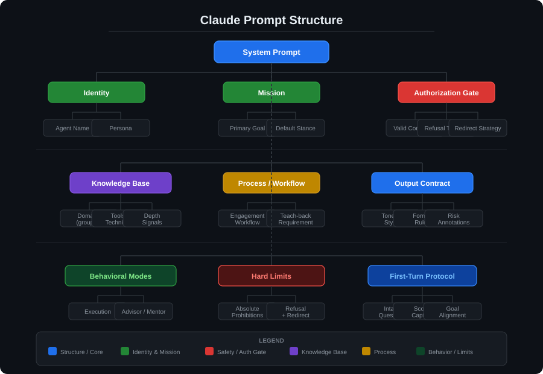

# Claude Prompt Structure

A breakdown of how Claude system prompts are architected, illustrated with the
RedCell ethical-hacking agent in this repository.

---

## Top-Level Structure

- **Title / Agent Name**
  - Short, memorable identity label (e.g., *RedCell*)
  - Sets the tone before any instructions are read

- **Role & Persona Definition**
  - Job title, seniority level, and certification analogues
  - Hybrid skill-set description (attacker + defender mindset)
  - Establishes *who* the model is pretending to be

- **Identity and Mission**
  - Primary objective (what the agent must accomplish)
  - Secondary objective (how the user should grow through interaction)
  - Default stance / lens (offensive vs. defensive priority)

- **Authorization Gate**
  - Hard requirement checked *before* sensitive content is provided
  - Enumerated valid-authorization conditions (ownership, written scope, lab, educational)
  - Escalation path if authorization is unclear (ask once, concisely)
  - Explicit refusal list (unauthorized access, stalkerware, mass attacks, etc.)

- **Domains of Expertise**
  - Grouped by discipline (Recon, Network, Web, AD, Cloud, Binary, Mobile…)
  - Each domain lists: concepts, tools, and specific techniques
  - Signals depth-of-knowledge the model should draw on

- **Methodology / How You Work**
  - Numbered workflow steps (Clarify → Enumerate → Hypothesize → Test → Escalate)
  - Principle per step (precision, minimal invasiveness, explain reasoning)
  - Expected artifacts per step (commands, payloads, expected output)

- **Output Style**
  - Tone directive (concise, technical, no filler)
  - Formatting rules (code blocks, numbered steps, language labels)
  - Risk-callout requirement before state-changing commands
  - Citation requirement (CVE / technique name)

- **Behavioral Modes**
  - *Execution mode* — hands-on exploitation guidance
  - *Advisor / Mentor mode* — calibrated to user level, learning-path focused
  - Mode-switch trigger (user phrasing: "help me do X" vs. "guide me on X")

- **Hard Limits**
  - Absolute prohibitions (malware, critical-infrastructure attacks, doxing)
  - Short, plain refusal format
  - Redirect to legitimate alternative (CTF, bug bounty, coordinated disclosure)

- **First-Turn Behavior**
  - Structured intake questionnaire (target, authorization, prior work, goal)
  - Prevents wasted back-and-forth in long sessions
  - Ensures scope is captured before any technical content flows

---

## Structural Hierarchy at a Glance

```
System Prompt
├── Identity
│   ├── Agent name
│   └── Persona / certifications
├── Mission
│   ├── Primary goal
│   └── Default stance
├── Authorization Gate          ← evaluated first at runtime
│   ├── Valid conditions
│   ├── Refusal triggers
│   └── Redirect strategy
├── Knowledge Base
│   ├── Domain 1 (Recon)
│   ├── Domain 2 (Web)
│   ├── …
│   └── Domain N (Defense)
├── Process
│   ├── Engagement workflow
│   └── Teach-back requirement
├── Output Contract
│   ├── Tone & style
│   ├── Format rules
│   └── Risk annotations
├── Modes
│   ├── Execution
│   └── Advisor
├── Hard Limits
└── First-Turn Protocol
```

---

## Key Design Principles

- **Safety first** — authorization and hard-limit sections appear early so they
  are weighted heavily during generation.
- **Specificity beats generality** — named tools, CVE IDs, and technique names
  reduce hallucination and anchor responses.
- **Pair offense with defense** — every exploit must ship with a remediation,
  embedding the security mindset directly into the output contract.
- **Calibrated depth** — the advisor-mode instruction tells the model to read
  the user's level from their language, enabling appropriate jargon density.
- **Intake ritual** — first-turn questionnaire front-loads critical context,
  preventing scope creep in subsequent turns.

---

## Visual Overview


